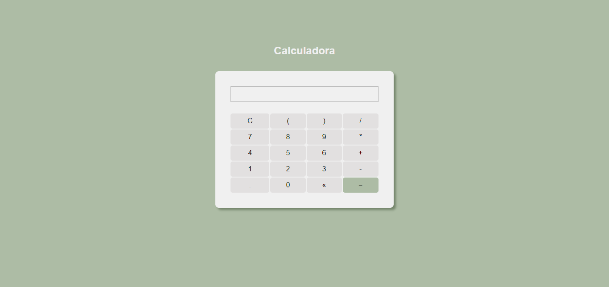

<h2>Calculadora</h2> 

  Projeto feito para o curso da Udemy: JavaScript/TypeScript fullstack, onde colocamos em prática nosso conhecimento em funções (functions), em tomadas de decisões com base em condições (if/else).
  E utilizamos o try/catch para controlar possíveis erros.

